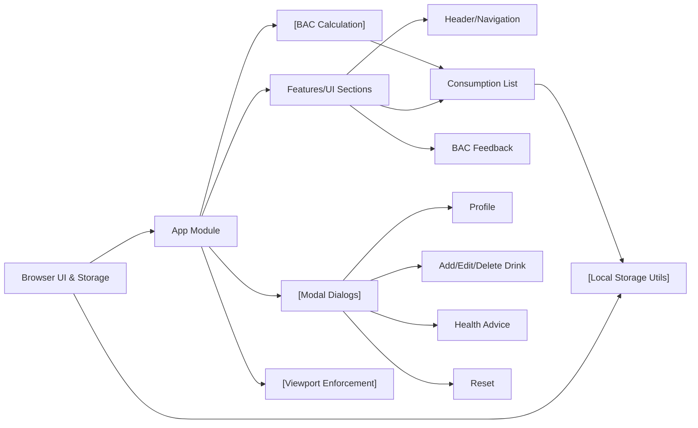

# App Module

## Overview
The App module serves as the main orchestrator and entry point for the Alcool Tracker application. It manages the global state (user profile, consumption data, and calculated blood alcohol content), controls the modal dialogs, and coordinates the rendering of all top-level components visible on the main screen. Its purpose is to provide users with a seamless interface for inputting and tracking their alcohol consumption, viewing health insights, and managing their personal profile.

## Key Features
- **User Profile Enforcement**: Ensures that a user profile (weight and gender) is defined before enabling other features. Prompts users to complete their profile on first use or after a reset.
- **Alcohol Consumption Tracking**: Allows users to add, edit, and delete records of alcoholic drinks consumed. Keeps a persistent and up-to-date log of all recorded drinks.
- **Blood Alcohol Content (BAC) Calculation**: Dynamically calculates the user's estimated BAC using historical consumption data and personal profile information. Updates automatically with any new input.
- **Health Advice & BAC Level Feedback**: Provides accessible health recommendations and visualizes current BAC to inform users about their risk and help them make safer choices.
- **Session Reset and Data Persistence**: Offers reset options to clear all stored data, resetting the profile and consumption history. Uses persistent storage to save user decisions between sessions.
- **Responsive UI with Modal Management**: Manages various modal dialogs for editing drinks, updating the profile, viewing health information, and confirming data resets. Prevents interaction until necessary user data is supplied.
- **Viewport Restriction Handling**: Detects device width and restricts access from non-supported viewports, enforcing a desktop-only experience.

## System Errors
- **Missing Profile Data**: If the user's weight or gender is not set, key features remain inaccessible and the profile modal is forced open.
  - **Resolution**: Users must input their weight and gender to proceed.
- **Outdated Consumption Data**: Old drink records (from previous days) may persist, causing inaccurate BAC calculations.
  - **Resolution**: The system automatically purges these entries on load, but if issues arise, a manual reset resolves it.
- **Corrupted Local Storage Data**: Failed data retrieval from persistent storage may result in app errors or stalled calculations.
  - **Resolution**: Users can perform a data reset to clear and recover the state.
- **Unsupported Viewport Size**: On tablets/mobile widths, the main interface is blocked and a notification is shown.
  - **Resolution**: Maximize the window or use a desktop viewport to access the application.

## Usage Examples

```jsx
// The App component is rendered by React at the top level.
// Most usage is internal; here is a simplified illustration:

import React from 'react';
import App from './App';

function Root() {
  return <App />;
}

export default Root;

// Example: Resetting user data programmatically (for advanced integration)
import { resetData } from './utils/helpers';

resetData(); // This will reset all user data and BAC calculations

// Example: Add a new drink programmatically
import { getData, setData } from './utils/helpers';

const currentConsumption = getData('consumption') || [];
currentConsumption.push({
  // popuplate date, drink info, quantity, etc.
});
setData('consumption', currentConsumption);
```

## System Integration


**Legend**:
- `browser`: Runs the React app, handles user interactions, and provides access to persistent storage.
- `appModule`: The App component, central controller orchestrating state and UI.
- `featureModules`: UI sections: header, consumption list, BAC display, navigation.
- `modals`: Groups modal dialogs managed by App.
- `bacService`: Blood Alcohol Content calculation logic.
- `storageHelpers`: Utilities for loading, saving, and resetting app state.
- `viewportRestriction`: UI component that blocks the app on unsupported (non-desktop) screen sizes.
- Arrows denote data and workflow dependencies.

**Note:** External integrations (e.g., Iconoir icons, Tailwind CSS) are injected at the build and UI levels and do not directly interact with the App module logic.