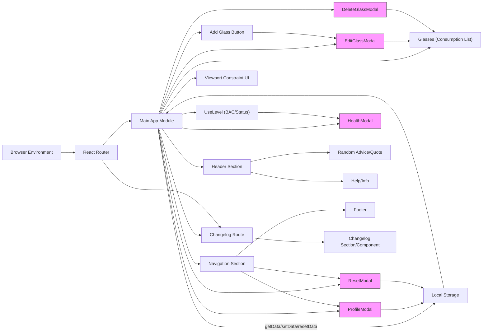

# Application Architecture

## Overview
This module provides an overview of the core architectural structure of the Alcool Tracker application. It outlines how main UI sections, modal components, data management, and routing are orchestrated to deliver the application's alcohol tracking features. This documentation is intended to help developers understand the high-level flow, module collaborations, and user-facing features, clarifying how the system fits together as a single-page React application.

## Key Features

- **Single Page Application Routing**: Uses React Router to manage in-app navigation between the main tracker interface and secondary routes such as the Changelog page, ensuring seamless user experience without full page reloads.
- **Consumption Management**: Enables users to add, edit, and delete records of alcohol consumption. Each consumption entry is stored and used to calculate the user's real-time blood alcohol level.
- **Profile & Settings**: Provides UI workflows for users to define fundamental profile information (gender, weight, probationary license), which are critical for calculating personalized blood alcohol levels.
- **Status & Health Feedback**: Dynamically calculates and presents the user's blood alcohol concentration (BAC), and provides health state feedback based on their data.
- **Modal Components**: Integrates a suite of modal dialogs for actions like adding/editing glasses, viewing health effects, editing profiles, deleting consumption records, and resetting all application data, ensuring focused user task flows.
- **Persistent Local Storage**: Application state relevant to consumption and user profile is saved in local storage, supporting session continuity and offline-first usage.

## System Errors

- **Local Storage Access Errors**: If getData or setData cannot read/write local storage, user data will not persist between sessions.  
  *Resolution*: Ensure browser local storage is enabled and available.
- **Invalid Profile Data**: ProfileModal validates that weight is a non-empty, non-null number. If the input is invalid, the user receives error message feedback and profile submission is blocked.  
  *Resolution*: Enter a valid weight before proceeding.
- **Consumption Entry Validation**: When adding or editing a glass, missing or non-positive values for volume or alcohol content are not accepted.  
  *Resolution*: Set valid (positive, non-empty) values for all required fields.
- **Modal Interaction Edge Cases**: Attempting operations with inconsistent app state (e.g., deleting a glass that is no longer present) may result in UI desynchronization.  
  *Resolution*: Refresh the application if inconsistencies are encountered.

## Usage Examples

```jsx
// Navigating to the main application
import { createBrowserRouter, RouterProvider } from 'react-router-dom';
import App from './App';

const router = createBrowserRouter([{ path: '/', element: <App /> }]);
<RouterProvider router={router} />;

// Opening the profile modal from Navigation
<Navigation onProfileButtonClick={() => setIsProfileModalOpen(true)} />

// Adding a glass
<AddGlassButton onClick={() => setIsEditGlassModalOpen(true)} />

// Editing an existing consumption record
<EditGlassModal
  closeModal={() => setIsEditGlassModalOpen(false)}
  setConsumption={setConsumption}
  selectedGlassIndex={activeIndex}
/>

// Resetting all application data
<ResetModal
  closeModal={() => setIsResetModalOpen(false)}
  onSubmit={() => handleReset()}
/>
```

## System Integration


