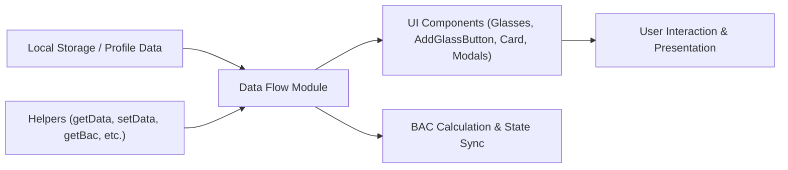

# Data Flow

## Overview
The Data Flow module orchestrates the central mechanism for managing, persisting, and presenting the user's alcohol consumption data within the Alcool Tracker application. It ensures coherent interaction between UI components, business logic (BAC calculations, glass management), and local storage, acting as a backbone for how consumption information is captured, calculated, and displayed throughout the system.

## Key Features

- **Consumption State Management**: Manages the list of drinks ("glasses") the user adds, edits, or deletes, tracking each glass with its volume, alcohol degree, and timestamp.
- **BAC Calculation Triggering**: Calculates the Blood Alcohol Content (BAC) automatically based on the current consumption state, profile information (weight, gender), and elapsed time.
- **Persistent Storage Integration**: Reads from and writes consumed glasses and profile details to browser local storage, ensuring user data is retained across sessions.
- **Profile Enforcement & Workflow Control**: Controls app flow by requiring a defined user profile (weight, gender) before allowing main feature access.
- **Glass Editing & Deletion**: Supports in-place modification and removal of existing glasses, updating the data state and triggering dependent logic.
- **Safety Reset & Data Aging**: Enables full data reset by the user and automatically prunes out-of-date (older than one day) consumption entries to keep records current.
- **Modular Component Communication**: Provides a consistent, state-driven data interface to child components (Glasses, AddGlassButton, Card, Modals, BAC readouts) for seamless UI updates.

## System Errors

- **Missing Profile Data**:  
  **Description**: If user profile data (weight or gender) is not set, certain functionality (like BAC calculation or main app usage) is blocked.  
  **Resolution**: The profile modal is triggered, requiring the user to enter missing profile data before proceeding.

- **Corrupted Storage Data**:  
  **Description**: If local storage returns unusable or missing data (e.g., consumption not an array), calculations like BAC will throw errors.  
  **Resolution**: Advise the user to reset data via the UI. On reset, local storage is cleared and the application state is reinitialized.

## Usage Examples

```javascript
// Load and display current consumption list
const consumption = getData('consumption') || [];
console.log(consumption); // [{ centilitersVolume: 25, alcoholContent: 7, date: ... }, ...]

// Add a glass (via AddGlassButton and EditGlassModal)
setConsumption([...consumption, { centilitersVolume: 15, alcoholContent: 12, date: new Date() }]);

// Calculate BAC after changes (automatically triggered)
const bac = getBac(consumption, getData('gender'), getData('weight'));
console.log('Current BAC:', bac);

// Remove a glass (user triggers deletion)
const newList = [...consumption];
newList.splice(glassIndexToDelete, 1);
setConsumption(newList);

// Reset all user data (resets application to first-launch state)
resetData();
setConsumption([]);
setMyBloodAlcoholLevel(0);

// Automatic pruning of old entries (runs on app start)
const refreshedConsumption = getData('consumption');
const yesterday = new Date();
yesterday.setDate(yesterday.getDate() - 1);
refreshedConsumption.forEach((glass, idx) => {
  if (new Date(glass.date) <= yesterday) {
    refreshedConsumption.splice(idx, 1);
    setConsumption(refreshedConsumption);
  }
});
```

## System Integration


