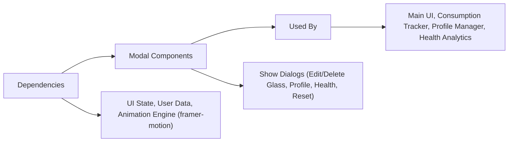

# Modal Components

## Overview
The Modal Components module provides user-facing dialog boxes for key alcohol tracking workflows. These modals simplify critical interactions such as editing glass entries, managing user profile data, resetting data, visualizing alcohol health impact, and confirming deletions. Modals are a central part of the UI, guiding users through decisions and data manipulations while ensuring clarity and safety.

## Key Features

- **Delete Glass Modal**: Confirms deletion of a specific glass entry, allowing users to safely remove consumption records.
- **Edit Glass Modal**: Enables users to add or modify details of a glass (volume, time, alcohol content) and get instant feedback such as calorie estimation.
- **Health Modal**: Displays the user's current estimated blood alcohol level with health guidance based on their consumption and profile; helps users understand their impairment level in real-time.
- **Profile Modal**: Lets users input or edit personal data (weight, gender, probationary license status) that influences BAC calculations and legal driving ability assessment.
- **Reset Modal**: Provides a warning and confirmation workflow for erasing all user data and starting fresh.

## System Errors

- **Validation Errors**:  
  - *Edit Glass Modal*:  
    - Empty or zero volume/alcohol content triggers: "Vous ne pouvez pas laisser ce champ vide ou nulle."
    - Guidance: Ensure both volume and alcohol content fields are filled with positive numbers.
  - *Profile Modal*:  
    - Empty or zero weight input: "Ce champ doit être un nombre non vide et non nulle."
    - Guidance: Enter a valid number for weight before submitting.
- **Action Cancellation**:  
  - All modals can be closed at any time using the close icon or clicking outside; unsaved changes are not applied.
- **Data Loss Warning**:  
  - *Reset Modal*: Warns before all consumption and profile data are deleted; irreversible.
  - Guidance: Confirm intent before validating this action.

## Usage Examples

```jsx
// Show Health Modal when user requests BAC info
<HealthModal closeModal={closeModalHandler} bloodAlcoholLevel={currentBac} />

// Add or edit a glass entry
<EditGlassModal
  closeModal={closeModalHandler}
  setConsumption={setConsumptionHandler}
  selectedGlassIndex={glassIndex}
  onDeleteClick={handleDelete}
/>

// Confirm deletion of a glass
<DeleteGlassModal
  closeModal={closeModalHandler}
  onSubmit={deleteGlassHandler}
  selectedGlassDate={glassDate}
/>

// Let user edit profile info
<ProfileModal closeModal={closeModalHandler} />

// Confirm app reset
<ResetModal closeModal={closeModalHandler} onSubmit={resetDataHandler} />
```

## System Integration



**How it fits:**  
Modal Components operate at the boundary between user interface and data logic. They are invoked by main views when an action needs user confirmation, additional data entry, or important feedback. Modals rely on system state (like user profile and consumption data) and propagate changes back to core application modules through exposed handler props. Their role is critical for safety, user engagement, and overall workflow clarity.