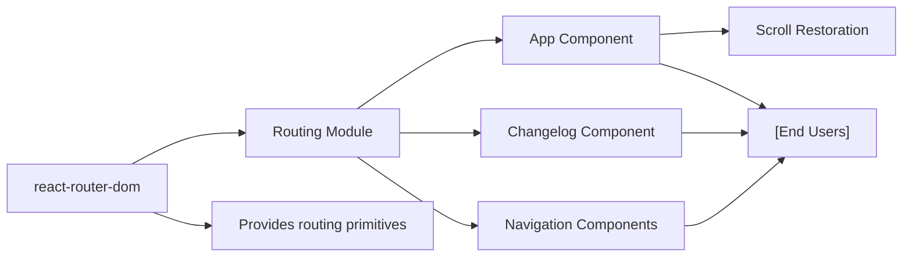

# Routing

## Overview
The Routing module organizes navigation within the Alcool Tracker application. It defines available routes, connects URL paths to React components, and manages how users interact with different app pages. Routing is essential for structuring the application's user experience and enabling navigation between the main tracking interface and supporting views like the changelog.

## Key Features
- **Declarative Route Mapping**: Associates URL paths (e.g., `/` and `/changelog`) with React components, determining which UI is displayed based on browser navigation.
- **History and State Management**: Integrates with React Router’s Browser Router for seamless client-side navigation without full page reloads, preserving app state across views.
- **Hierarchical Routing Support**: Enables future extension by supporting nested or additional routes as needed.
- **Central Navigation Control**: Ensures routing logic is centralized for maintainability and consistent navigation behavior.
- **Scroll Restoration**: Utilizes `<ScrollRestoration />` to maintain scroll position between navigations, improving user experience.

## System Errors
- **Route Not Found**: Navigating to an undefined path results in no component being rendered (no dedicated "404 Not Found" page).  
  *Resolution*: Define a fallback route for unmatched paths if desired.
- **Component Rendering Issues**: If the route’s target component has errors (e.g., rendering failure in `App` or `Changelog`), the affected route will display as blank or with an error overlay depending on React’s error boundaries.  
  *Resolution*: Use error boundaries or route-level fallback UI to capture errors gracefully.
- **Router Initialization Failure**: If the root `<RouterProvider />` fails to mount (typically due to missing root element or misconfiguration), the app won't render.  
  *Resolution*: Ensure that an HTML element with id="root" exists and the router is configured properly.

## Usage Examples

```jsx
// Setting up basic routing in src/index.js

import { createBrowserRouter, RouterProvider } from 'react-router-dom';
import App from './App';
import Changelog from './sections/Changelog';

const router = createBrowserRouter([
  { path: '/', element: <App /> },
  { path: '/changelog', element: <Changelog /> },
]);

<RouterProvider router={router} />
```

```jsx
// Navigating between routes using <Link> or useNavigate

import { Link } from 'react-router-dom';

function Navigation() {
  return (
    <nav>
      <Link to="/">Home</Link>
      <Link to="/changelog">Changelog</Link>
    </nav>
  );
}
```

```jsx
// Using <ScrollRestoration /> in App.js to maintain scroll positions

import { ScrollRestoration } from 'react-router-dom';

function App() {
  return (
    <main>
      {/* main content */}
      <ScrollRestoration />
    </main>
  );
}
```

## System Integration

