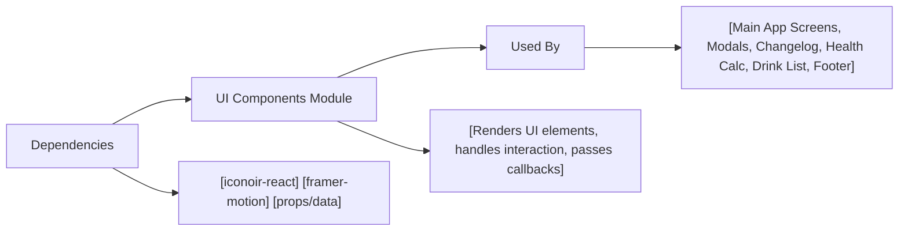

# UI Components

## Overview
The UI Components module provides a suite of reusable interface elements for the Alcool Tracker application. These components enable developers to build a consistent, interactive, and user-friendly frontend. By abstracting key visual and interactive behaviors, the module accelerates UI development while ensuring visual coherence across screens.

## Key Features

- **AddGlassButton**: An animated action button that enables users to log a new drink. Prominently positioned for accessibility and triggers application logic to update the user's drink record.

- **Backdrop**: Full-screen overlay used to provide modals or highlight focus areas. Disables background scroll and prevents user interaction with underlying content, improving modal accessibility and user flow.

- **CaloriesTooltip**: Interactive tooltip showing calorie information for drinks. Users can tap an icon to reveal contextual details, promoting informative UI design.

- **Card**: Visual container representing a single drink entry. Displays time, volume, alcohol content as well as iconography and supports actions such as selection and deletion, central to list and detail views.

- **ChangelogCaption**: Compact legend block for changelog screens, clarifying version states (current, in development, old) through color cues and labels, enhancing release note clarity.

- **Figure**: Animated statistic display for key metrics, such as blood alcohol level. Supports contextual info access, pulse indicators for attention, and dynamic value transitions.

- **Footer**: Static branding and copyright area, ensuring consistent attribution and enhancing trust.

- **LearnMoreButton**: Expandable control to reveal additional explanatory content, supporting progressive disclosure in interfaces that require extra explanation.

- **Quote**: Stylized block for displaying quoted advice or contextual information—typically used for tips, warnings, or memorable phrases.

- **Result**: Decision panel explaining whether the user can drive, based on current blood alcohol level; visualizes timing and guidance with dynamic messaging.

- **VersionTitle**: Styled header indicating version information, visually enhanced to reflect release state (work in progress, current, old), ideal for changelog or about sections.

## System Errors

- **Missing or Unresponsive Action**: If interactive components such as AddGlassButton or LearnMoreButton appear unresponsive, verify parent callback functions are provided and the application state is not blocked.  
  *Resolution*: Ensure props like `onClick` are passed from parent and the application's state management is working as intended.

- **Content Overlap or Unscrollable Background**: If Backdrop is used but the background can still be scrolled/interacted with, integration may have missed wrapping the modal content appropriately or event listeners were not registered.  
  *Resolution*: Confirm Backdrop surrounds modal content and is mounted/unmounted according to UI flow.

- **Tooltip or Modal Not Displayed Properly**: For calories and other tooltips, missing or misplaced overlay often results from misconfiguration of positioning classes or missing values.  
  *Resolution*: Verify correct value and className props are supplied.

## Usage Examples

```jsx
// AddGlassButton example: logs a glass on click
<AddGlassButton onClick={() => addGlass()} />

// Backdrop example: wraps a modal, prevents background interaction
<Backdrop onClick={closeModal}>
  <ModalContent />
</Backdrop>

// CaloriesTooltip example: show calories info for 120kcal
<CaloriesTooltip value={120} />

// Card example: represents a drink entry in a list
<Card
  time="21:00"
  centilitersVolume={25}
  alcoholContent={12.5}
  icon={<WineIcon />}
  onCardClick={() => selectEntry(id)}
  onDeleteClick={() => removeEntry(id)}
  isSelected={selected}
  isDeleteSelected={deleteMode}
/>

// Figure example: displays computed blood alcohol level
<Figure
  number={0.05}
  text="Taux d'alcoolémie"
  openHealthModal={showHealthInfo}
  isHealthModalOpen={modalOpen}
  bloodAlcoholLevel={0.05}
/>

// Footer example: placed at app's bottom
<Footer className="mt-auto" />

// LearnMoreButton example: reveals extra information
<LearnMoreButton />

// Quote example: highlights a helpful tip
<Quote content="Ne jamais prendre la route après avoir bu." />

// Result example: displays if driving is safe
<Result bloodAlcoholLevel={0.08} />

// VersionTitle example: labels app version
<VersionTitle version="2.1" name="Sécurité" state="current" />
```

## System Integration


