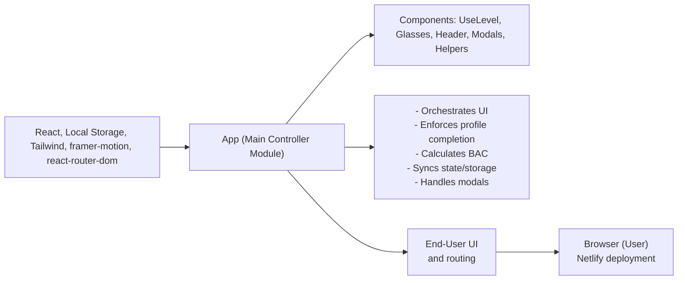

# App Module

## Overview
The App module serves as the main entry point and controller of the Alcool Tracker application. It orchestrates user profile configuration, alcohol consumption tracking, blood alcohol content (BAC) calculations, and all key user workflows. The module integrates various UI sections, modal dialogs, and manages persistence and state synchronization across the app. Its central role is to connect and coordinate the main features, enabling seamless BAC calculation and user interaction.

## Key Features
- **Profile Management Enforcement**: Ensures that essential user information (weight and gender) is provided before using core features, prompting users to complete their profile on first entry or after a reset.
- **Consumption Tracking**: Enables users to log, edit, and delete records of alcoholic beverages consumed. Maintains this consumption history in persistent storage.
- **Dynamic BAC Calculation**: Calculates the user's live blood alcohol content using the Widmark formula, factoring in user profile and logged drinks. BAC updates automatically as data changes.
- **Automated History Pruning**: Automatically removes any drinks from the consumption history that are over one day old, keeping data relevant and current.
- **Modal-Driven Workflows**: Integrates and displays context-specific modal dialogs for actions such as editing a glass, deleting an entry, updating the profile, resetting data, and viewing health information.
- **Responsive UI Integration**: Combines multiple UI sections and controls, ensuring the app is functional and user-friendly within the supported viewport constraints.

## System Errors
- **Profile Not Defined**: Users are blocked from accessing the main functionality if weight and gender data are missing.  
  *Resolution*: Complete the profile in the prompted modal dialog to proceed.
- **Storage Synch Issues**: If the browser's local storage is unavailable or corrupted, consumption history cannot be loaded or saved.  
  *Resolution*: Clear browser storage or try an alternative browser if persistent issues occur.
- **Outdated Consumption Entries**: Sometimes, older drinks may not be pruned due to unexpected application close/crash.  
  *Resolution*: Refresh the application; history will be cleaned on load.

## Usage Examples

```jsx
// Main app entry point: index.js
import React from "react";
import ReactDOM from "react-dom";
import App from "./App";

ReactDOM.render(<App />, document.getElementById("root"));

// In-App interactions (pseudo-steps):
// 1. On first open, fill in your weight and gender when prompted.
// 2. Tap 'Add Drink' to log a new beverage; enter volume and type.
// 3. See your live BAC update in the UI.
// 4. Tap on any drink entry to edit or delete it via corresponding modal.
// 5. Go to navigation and select profile or reset for further actions.
```

## System Integration


