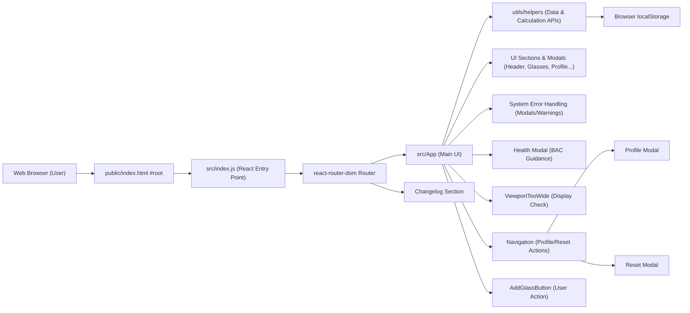

# Getting Started

## Overview
This project is a web application for tracking blood alcohol concentration (BAC) based on recorded drink consumption events. It enables users to log each drink, monitor their estimated BAC, and manage their history and profile. The application is client-side rendered using React, storing all data in the browser (localStorage), so no user authentication or server-side logic is required.

## Key Features

- **Consumption Tracking**: Allows users to add, edit, and delete records of drinks consumed, each including relevant details like time and type.
  
- **Blood Alcohol Level Calculation**: Dynamically estimates the user's BAC based on personal profile (weight, gender) and all logged drinks, updating as changes are made.

- **Profile Management**: Prompts for and stores key user details (weight and gender) required for BAC calculations. Users can edit their profile at any time.

- **Session Reset**: Provides a reset function to clear current consumption history and BAC, starting a new session.

- **Health Guidance**: Offers contextual health and safety guidance based on the current BAC level.

- **Responsive UI**: Designed primarily for mobile use, with warnings for unsupported wide screens.

- **Integrated Navigation**: Simple navigation controls for user profile, session reset, and adding new drinks.

- **Changelog Section**: Dedicated route to display recent changes and updates within the app.

## System Errors

- **Missing User Profile**:  
  - *Description*: If the user's weight and gender are not defined, core features (like BAC calculation) are disabled and the application proactively opens the profile modal.
  - *Resolution*: Complete the profile form to unlock full app functionality.

- **Data Persistence Issues**:  
  - *Description*: In rare cases (such as localStorage being disabled or unavailable), user data may not be saved between sessions.
  - *Resolution*: Ensure browser storage is enabled; otherwise, data cannot be retained locally.

- **Display Warnings (Viewport)**:  
  - *Description*: If the app detects a screen width outside supported parameters (e.g., wide desktop screens), a warning is shown.
  - *Resolution*: Switch to a mobile or tablet device for best experience.

## Usage Examples

```jsx
// Starting the application (entry point)
import React from 'react';
import ReactDOM from 'react-dom/client';
import { RouterProvider, createBrowserRouter } from 'react-router-dom';
import App from './App';
import Changelog from './sections/Changelog';

const router = createBrowserRouter([
  { path: '/', element: <App /> },
  { path: '/changelog', element: <Changelog /> },
]);

ReactDOM.createRoot(document.getElementById('root')).render(
  <React.StrictMode>
    <RouterProvider router={router} />
  </React.StrictMode>
);

// Example: Adding a glass (from UI)
<AddGlassButton onClick={() => setIsEditGlassModalOpen(true)} />

// Profile modal auto-opens if profile data is missing:
useEffect(() => {
  if (!getData('weight') || !getData('gender')) {
    setIsProfileModalOpen(true);
  }
}, []);
```

## System Integration

